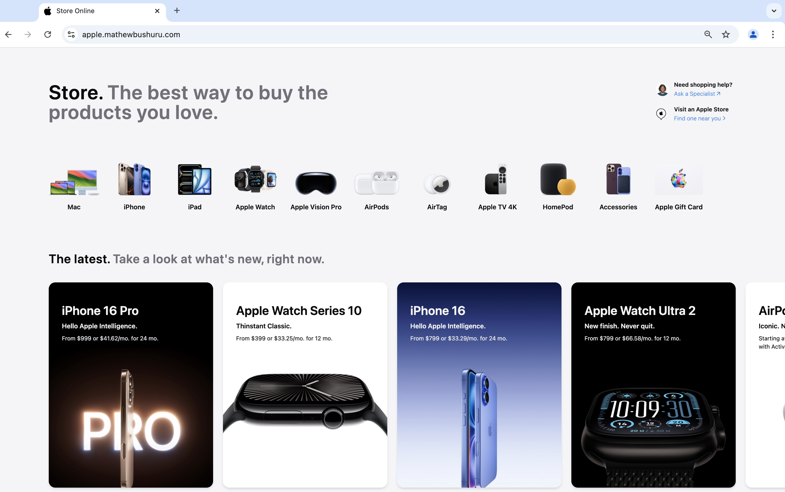

# Exploring Google Analytics and Google Tag Manager

In this repo, I explore configuring and using Google Analytics alongiside  with  Google Tag Manager in the context of an e-commerce application. I build a clone of the apple store to use as the website where I add Google Analytics. You can visit the completed site at [apple.mathewbushuru.com](https://apple.mathewbushuru.com/). The design is fully accessible on mobile, tablet and desktop.

